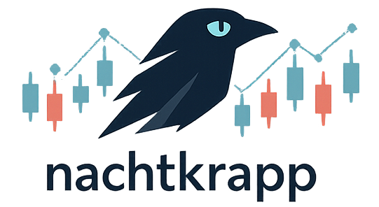

# nachtkrapp

The **pattern-detection** library. You give it a series and a set of rules; it
tells you where each pattern occurs.

> Human-friendly guide. Authoritative contract: [`CLAUDE.md`](CLAUDE.md).
> Background: [`../docs/concepts.md`](../docs/concepts.md).

## What it is for

`nachtkrapp` answers "where did *this* happen?" — a Heikin Ashi reversal, a
moving-average cross, an RSI overbought reading. It detects **primitives**; you
combine them with ordinary Java boolean logic to build higher-level alerts
(e.g. *bullish reversal AND price above the 50-day MA AND not overbought*).

It is a single self-contained module — the rule types, the match types and the
detection engine all live here.

## Adding the dependency

```xml
<dependency>
    <groupId>net.jacopobiscella</groupId>
    <artifactId>nachtkrapp</artifactId>
    <version>0.49.0-alpha</version>
</dependency>
```

Packages: `rule`, `match`, `spec`, `detector`, `error` under
`org.hatrack.nachtkrapp`.

## The three steps

### 1. Choose rules — `DetectionRule`

A sealed hierarchy of nine record variants. Each rule says what to look for:

| Family | Rules |
|---|---|
| Heikin Ashi | `HAColorChangeRule`, `HAStrongCandleRule`, `HADojiRule` |
| Moving average | `PriceVsMARule`, `PriceMACrossRule` |
| RSI | `RSIThresholdRule`, `RSILevel50CrossRule` |
| MACD | `MACDSignalCrossRule`, `MACDZeroCrossRule` |

```java
import org.hatrack.nachtkrapp.rule.DetectionRule;
import org.hatrack.nachtkrapp.rule.MAType;

var reversal = new DetectionRule.HAColorChangeRule(3);                       // 3-bar streak then a flip
var maCross  = new DetectionRule.PriceMACrossRule(MAType.SMA, 20, PriceSource.CLOSE);
var rsi      = new DetectionRule.RSIThresholdRule(14, new BigDecimal("70"),
                                                 new BigDecimal("30"), PriceSource.CLOSE);
```

Rule constructors only null-check; out-of-range parameters (e.g. period 0) are
caught later by the builder, not at construction.

The Heikin Ashi rules require an `HASeries`; the indicator rules require a
`PriceSource` that matches the series type. Mismatches are rejected by the
builder.

### 2. Build the spec — `DetectionSpec`

```java
import org.hatrack.nachtkrapp.spec.DetectionSpec;

DetectionSpec spec = DetectionSpec.builder()
        .withSeries(new HASeries(haBars))
        .addRule(reversal)
        .addAllRules(List.of(/* more rules */))
        .withTimeframe(Timeframe.fromWire("1d"))   // optional — tags every match for provenance
        .build();                                  // throws InvalidDetectionSpecException
```

`build()` validates eagerly — rules **V1–V10**: series set and non-empty, bars
ordered with unique times, rule/series-type compatibility, enough bars for
each rule, parameter ranges, no duplicate rules, and OHLC invariants of an
`OHLCSeries`. The exception carries a `violatedRule` string (`"V1"…"V10"`).

### 3. Detect — `PatternDetector`

```java
import org.hatrack.nachtkrapp.detector.*;

PatternDetector detector = new RuleBasedPatternDetector();
DetectionResult result = detector.detect(spec);    // throws DetectionException

for (PatternMatch m : result.matches()) {           // ordered ascending by time
    System.out.println(m.getClass().getSimpleName() + " @ " + m.time()
            + " [" + m.flavor() + "]");
}
```

`PatternDetector` is an **interface** — program against it so you can mock it
in your own tests. `RuleBasedPatternDetector` is the supplied implementation.
It is **thread-safe**: build one and share it across threads.

## Reading matches — `PatternMatch`

A sealed hierarchy of 19 variants (`HABullishReversal`, `PriceCrossedAboveMA`,
`RSIOverbought`, `MACDBullishCross`, …). Every match carries:

- `time()` — the bar that triggered it;
- `flavor()` — `EVENT` (a discrete transition that happened on one bar) or
  `STATE` (a continuous condition that holds on that bar);
- `timeframe()` — the optional provenance tag from the spec;
- plus variant-specific diagnostic fields (the indicator value, the streak
  length, the bar, …).

`EVENT` vs `STATE` matters: `PriceCrossedAboveMA` is an event (emitted once, on
the crossing bar); `PriceAboveMA` is a state (emitted on *every* bar the
condition holds).

## Errors

All checked, all rooted at `DetectionException`:

| Exception | When |
|---|---|
| `InvalidDetectionSpecException` | malformed spec — thrown by `build()`; carries `violatedRule` |
| `InsufficientDataException` | data too short for a rule at detect time (normally caught earlier by V6) |
| `DetectionInternalException` | an internal failure; wraps the cause |

A `null` spec passed to `detect()` is a programmer error → `NullPointerException`,
not a `DetectionException`.

## Guarantees

- **Lookahead-safe** — a match at time *t* depends only on bars up to *t*.
- **Deterministic & idempotent** — same spec, same result, every time.
- **Thread-safe** — one detector instance, many threads.

## Out of scope (v1)

Classical candlestick patterns, chart patterns (head-and-shoulders, …),
divergences, compound-rule DSLs. Compose primitives in your own code.
